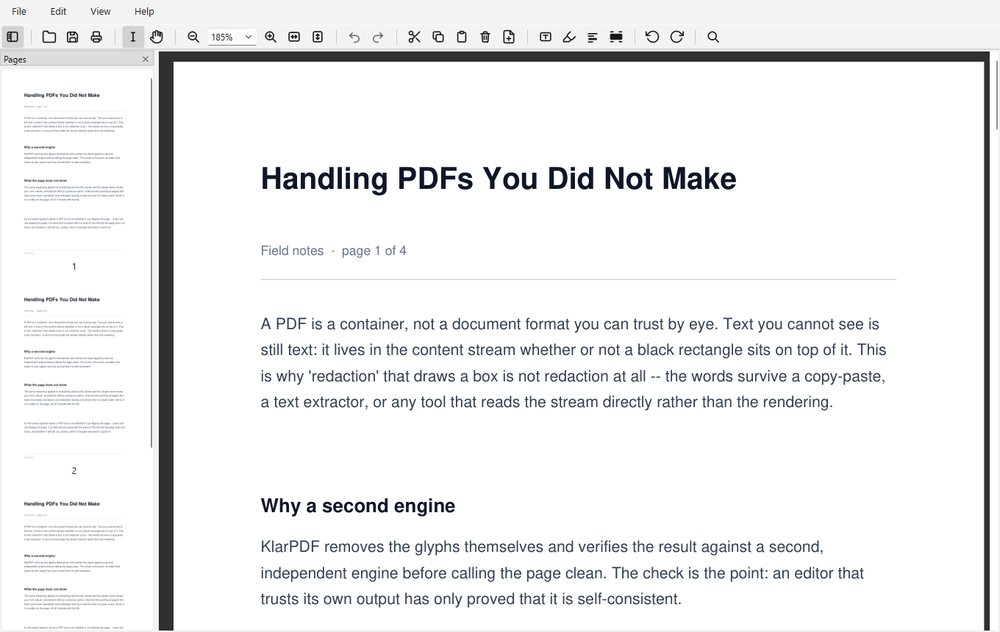

<!-- The hero, the screenshots and the badges are the repo's shop window (assets/brand/BRAND.md
     §GitHub assets). GitHub strips CSS from markdown, so brand colour can only arrive via images and
     badges — and <picture> + prefers-color-scheme is the *supported* way to theme them: GitHub wraps
     it in its own <themed-picture> element and swaps on the viewer's theme. -->
<picture>
  <source media="(prefers-color-scheme: dark)" srcset="assets/brand/github-hero-dark.svg">
  <source media="(prefers-color-scheme: light)" srcset="assets/brand/github-hero-light.svg">
  
</picture>

<p align="center">
  <a href="LICENSE"></a>
  <a href="https://github.com/utyagi24/klarpdf/actions/workflows/test.yml"></a>
  <a href="https://github.com/utyagi24/klarpdf/releases/latest"></a>
  
  <a href="https://github.com/sponsors/utyagi24"></a>
</p>

Local, offline, **native-Windows** PDF viewer + page editor (Python · PySide6 · PyMuPDF) — a
trustworthy replacement for macOS Preview's view + splice/split workflow on Windows. The source is
the unit of audit; it ships as a pinned, fully offline Windows installer.

<picture>
  <source media="(prefers-color-scheme: dark)" srcset="assets/screenshots/klarpdf-dark.png">
  <source media="(prefers-color-scheme: light)" srcset="assets/screenshots/klarpdf-light.png">
  
</picture>

<p align="center"><sub>The real app, captured from a real build — and it follows the Windows theme, so
this screenshot follows your GitHub one.</sub></p>

**Status: `v0.12.0` shipped** — [download the installer or portable exe](https://github.com/utyagi24/klarpdf/releases/latest).
**New in v0.12.0 "Navigate & Polish":** an Outline (bookmarks) sidebar with Go to Page (Ctrl+G),
right-click menus everywhere, a search-results list, page cropping (hidden — not removed),
night reading mode, a new Tools menu — and a save-fidelity fix for URI links some PDFs lose. Full
release notes live on [GitHub Releases](https://github.com/utyagi24/klarpdf/releases); live status —
milestones (**M0–M38 + R1 complete**), per-release notes, open follow-ups — in [PROGRESS.md](PROGRESS.md).

## Features

The macOS-Preview workflow, rebuilt for Windows: a fast viewer that is also a page editor.
Everything below works **fully offline** — the app makes no network connections, ever.

**View**
- Continuous-scroll viewer with zoom, a live zoom readout, and **Fit Width / Fit Page** that stay
  sticky as you resize.
- **Select & copy text** — exactly the document's (OCR) text layer — and **search** with
  highlighted hits, next/previous navigation, and **List All**: every match with its context
  line, click to jump.
- **Pages sidebar** with live thumbnails that reflect your current edits; thumbnails load lazily,
  so a 320-page document opens in ~150 ms.
- **Outline sidebar** — a document with bookmarks gets a Pages | Outline switcher: the live
  bookmark tree tracks your scroll position, follows your edits, and jumps on click. Plus
  **Go to Page…** (Ctrl+G).
- **Night reading mode** — inverts the page for dark-room reading; printing, export, and the
  file itself stay true-colour.
- **Right-click menus everywhere** — the verbs fit what's under the cursor: text selection
  (copy / highlight / redact), links (jump, or copy an external link's address), annotations,
  the page, and the sidebar.
- **Clickable internal links** — click to jump to the target page.
- Opens **password-protected PDFs** (prompted on open; the saved copy is unencrypted).
- **Grab / Select** viewer-mode toggle; a window opens on the monitor under your cursor, at
  Fit Page, without flicker.
- Follows the **Windows light/dark theme** live — the toolbar icons re-tint the moment you switch.
- **Remembers where you were**: last page, zoom, scroll, and window geometry per document — plus
  **Open Recent**.

**Organize pages** — the splice/split workflow
- **Drag-and-drop reorder**, delete, and rotate pages in the Pages sidebar.
- **Crop pages** — drag the area to keep, applied to this page / selected / all. Cropping
  *hides* (use Redact to remove permanently); **Remove Crop** restores the full page any time,
  even for a crop the file arrived with.
- **Merge / splice**: drag a PDF in from File Explorer to insert its pages at any position.
- **Cut / copy / paste pages** — including **between two open documents**.
- **Undo / redo** (Ctrl+Z / Ctrl+Y) for every page edit.
- **Lossless saves**: pages are copied at the object level, so the text (OCR) layer and form fields
  survive untouched, and **bookmarks and internal links are rebuilt** to keep working after
  reorder / delete.
- Save / Save As, with a **Save / Discard / Cancel** prompt on close.

**Annotate, redact & fill**
- **Highlight** text, and add **styled text boxes** — font family, size, colour, box fill and
  outline; drag to move, double-click to re-edit, **also after reopening the saved file**.
- **True destructive redaction**: drag over text or a region and it is permanently removed at save
  — a cross-engine-verified, confirmed point of no return.
- **Fill AcroForm forms**; values save losslessly.
- **Edits-aware printing** — the printout shows your annotations, form values, and redactions (an
  unsaved redaction never prints the original).
- **Export → PDF (flatten)**: bakes annotations + form widgets into the page content,
  text-preserving.

**Images**
- **Import** a PNG/JPEG from Explorer as a new page.
- **Export** selected pages as PNG/JPEG at a chosen DPI, edits-aware.

**File safety**
- **Revert to Saved**; a warning when **another program modifies the open file** (Reload / Keep);
  and an overwrite guard before Save.

**A native Windows citizen**
- Registers in the `.pdf` **Open With** list — built to be your default viewer.
- **Single instance, one window per document**: opening an already-open file focuses its window,
  never spawns a duplicate.
- Per-user install (no admin), Start-Menu shortcut, clean uninstall — or a single-file portable
  exe.

**Private & auditable by design**
- **No network access** at install or runtime, no telemetry, no accounts, no upsell.
- Readable Python source is the unit of audit; every dependency **pinned by hash and vendored**;
  free software under the AGPL.

## Use it (Windows)

Grab the [latest release](https://github.com/utyagi24/klarpdf/releases/latest):

- **`klarpdf-setup-x64.exe`** — installer (per-user, no admin). Adds KlarPDF to the `.pdf` **Open
  With** list + a Start-Menu shortcut; clean uninstall. *Recommended.*
- **`klarpdf-portable-x64.exe`** — single-file portable build; run from any folder (slower first
  launch, no file association).

Windows-on-Arm devices run this via x64 emulation (no native arm64 build yet). The `-x64` suffix
names the only architecture built today — see PLAN.md §Packaging.

No Python and no network needed at install or runtime. Unsigned for now → a one-time SmartScreen
"unknown publisher" prompt. Verify a download against `SHA256SUMS` in the release.

*Upgrading from a pre-rename `pdfproj` build (≤ v0.9.6)?* **Uninstall it first** — KlarPDF installs
as a separate application, and the old uninstaller is the only thing that removes its file
association. Then delete `%LOCALAPPDATA%\pdfproj` by hand.

## The repo — docs & layout

| Doc | What |
|---|---|
| [PLAN.md](PLAN.md) | The design source of truth: product spec, architecture, dependencies/packaging, portability, build order, **Execution**, verification |
| [PROGRESS.md](PROGRESS.md) | The status source of truth: milestone checklist, per-release notes, release links, **Open follow-ups** |
| [RELEASE.md](RELEASE.md) | Maintainer runbook — change a dependency · respond to a Dependabot alert · cut a release (via the `invoke` tasks) |
| [CLAUDE.md](CLAUDE.md) | Orientation + working conventions for contributors/agents |
| [DEPENDENCIES.md](DEPENDENCIES.md) | Pinned libraries + build toolchain — exact versions, licenses |
| [CONTRIBUTING.md](CONTRIBUTING.md) | How contributions work: issues open to everyone; pull requests maintainer-only |
| [SECURITY.md](SECURITY.md) | Security policy — supported versions, threat model, how to report |
| [CODE_OF_CONDUCT.md](CODE_OF_CONDUCT.md) | Community standards |

Source layout, briefly:

```text
launcher.py                # entry point — single-instance logic, then hands off to app.py
app.py · main_window.py    # Qt application + the document window
model/                     # edit engine: virtual document, page edits, save, outline/link remap
viewer/                    # rendering, selection, search, annotations, forms, printing
organize/                  # Pages sidebar (thumbnails, drag-and-drop)
ui/ · store/ · util/       # icons + About · view-state/recents · path identity + resources
platform_integration.py    # ALL OS-specific code, quarantined behind one seam
packaging/                 # PyInstaller spec, Inno Setup script, build.ps1
vendor/ · requirements-*   # the pinned + vendored offline dependency ship-set
tests/                     # 414 headless tests (offscreen Qt), run in CI on every PR
```

## Develop (WSL)

```bash
# one-time: base Ubuntu python lacks ensurepip
sudo apt install -y python3.12-venv

python3 -m venv .venv && . .venv/bin/activate
pip install -r requirements-dev.txt
invoke test                     # 414 headless tests (offscreen Qt) — or run `pytest`
invoke --list                   # all build/release tasks: test · audit · lock · build · tag · publish
python launcher.py file.pdf     # run the GUI via WSLg
```

The cross-platform core (`model/`, `viewer/`, `organize/`) + headless tests run in WSL; the GUI
iterates via WSLg. Packaging and Windows shell-integration happen on Windows only
(PLAN.md §Development environment). **git is the only bridge** between the WSL and Windows checkouts.
Build steps are wrapped as [`invoke`](tasks.py) tasks; CI runs the full suite on every PR and a
weekly dependency audit (`.github/workflows/test.yml`, `audit.yml`).

## Build the Windows installer

On Windows (python.org 3.12 + Inno Setup 6), from the repo root:

```powershell
invoke build            # wraps packaging\build.ps1: wheels -> clean venv -> freeze -> installer + portable + SHA256SUMS (dist\)
```

CI does the same on a tag: push a `v*` tag and `.github/workflows/release.yml` builds on
`windows-latest` and publishes a **draft** GitHub Release (PLAN.md §Packaging §5). The full
end-to-end flow — version bump → tag → draft → smoke → publish, with the `invoke tag` / `invoke
publish` shortcuts — is in **[RELEASE.md](RELEASE.md)**.

## Support

KlarPDF is free, and free software — every feature, no upsell, no telemetry, and that does not change.
If it saves you time and you want to fund the work, you can
**[sponsor it on GitHub](https://github.com/sponsors/utyagi24)**. Entirely voluntary; nothing here is
gated on it. The same link lives in the app under **Help ▸ Donate…**.

Not paying? Just as useful: a good [bug report or feature request](https://github.com/utyagi24/klarpdf/issues/new/choose).

## License

KlarPDF is licensed under the **GNU Affero General Public License v3.0 or later
(`AGPL-3.0-or-later`)** — full text in [LICENSE](LICENSE).

Why AGPL and not MIT/BSD: KlarPDF renders and edits PDFs with **PyMuPDF**, which is itself
**AGPL-3.0** (or an Artifex commercial license). KlarPDF links it and is a derivative work, so the
whole project must ship under the AGPL — it cannot be relicensed as MIT/BSD (see
PLAN.md §Public-release readiness). The LGPL-3.0 (PySide6 / shiboken6) and BSD-3-Clause (pypdf) terms
of the other bundled libraries are satisfied by the same source release. Per-dependency versions,
license identifiers, and notices are in **[THIRD_PARTY_LICENSES](THIRD_PARTY_LICENSES)**
(cross-referenced by [DEPENDENCIES.md](DEPENDENCIES.md)).

Because the app is AGPL, public distribution must offer the corresponding source — this repository at
the exact release tag each installer is built from satisfies that. Building for **your own machines**
is private use with no such obligation.

**Build from source:** see [Develop (WSL)](#develop-wsl) to run it, and
[Build the Windows installer](#build-the-windows-installer) to produce `klarpdf-setup-x64.exe` /
`klarpdf-portable-x64.exe` yourself.

## Audit notes

Dependencies are pinned with hashes and vendored for an offline, auditable build, and
**continuously scanned** for known advisories (`pip-audit` in CI + Dependabot alerts; bumps follow
[RELEASE.md](RELEASE.md)). See DEPENDENCIES.md and PLAN.md §Packaging.
