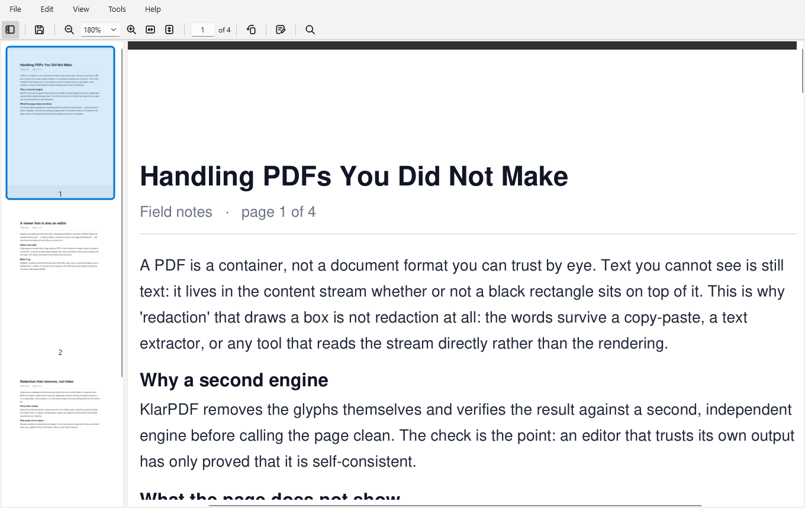

<!-- The hero, the screenshots and the badges are the repo's shop window (assets/brand/BRAND.md
     §GitHub assets). GitHub strips CSS from markdown, so brand colour can only arrive via images and
     badges — and <picture> + prefers-color-scheme is the *supported* way to theme them: GitHub wraps
     it in its own <themed-picture> element and swaps on the viewer's theme. -->
<picture>
  <source media="(prefers-color-scheme: dark)" srcset="assets/brand/github-hero-dark.svg">
  <source media="(prefers-color-scheme: light)" srcset="assets/brand/github-hero-light.svg">
  
</picture>

<p align="center">
  <a href="LICENSE"></a>
  <a href="https://github.com/utyagi24/klarpdf/actions/workflows/test.yml"></a>
  <a href="https://github.com/utyagi24/klarpdf/releases/latest"></a>
  
  <a href="https://github.com/sponsors/utyagi24"></a>
</p>

Local, offline, **native-Windows** PDF viewer + page editor (Python · PySide6 · PyMuPDF) — a
trustworthy replacement for macOS Preview's view + splice/split workflow on Windows. The source is
the unit of audit; it ships as a pinned, fully offline Windows installer.

<picture>
  <source media="(prefers-color-scheme: dark)" srcset="assets/screenshots/klarpdf-dark.png">
  <source media="(prefers-color-scheme: light)" srcset="assets/screenshots/klarpdf-light.png">
  
</picture>

<p align="center"><sub>The real app, captured from a real build — and it follows the Windows theme, so
this screenshot follows your GitHub one.</sub></p>

**Status: `v0.17.1` shipped** — [download the installer or portable exe](https://github.com/utyagi24/klarpdf/releases/latest).
**New in v0.17.1 — a security patch, and the Pages sidebar rolls smoothly:** the bundled `pypdf`
library moves **6.14.2 → 6.15.0**, closing two advisories where a **crafted PDF** could make parsing
burn unbounded CPU and memory (oversized CID font width ranges, oversized `/ToUnicode` streams).
Alongside it, **scrolling the Pages sidebar no longer jumps** — a wheel click used to throw the strip
an entire viewport, about **2.76 thumbnails**, because two wrong factors were multiplied together.
It now rolls **continuously**, a third of a thumbnail per click, so a thumbnail can sit half-visible
at the top the way it does in Edge; the distance scales with the sidebar's width, and it deliberately
ignores the Windows "lines to scroll" setting, which is a *text* preference the document view still
honours. No other behaviour changes from v0.17.0.
Full release notes live on
[GitHub Releases](https://github.com/utyagi24/klarpdf/releases); live status — milestones
(**M0–M38 + R1–R6 complete**), per-release notes, open follow-ups — in [PROGRESS.md](PROGRESS.md).

## Features

The macOS-Preview workflow, rebuilt for Windows — a fast viewer that is also a page editor.
Everything here works **fully offline**: the app makes no network connection, ever.

**Read & navigate**
- **Two-tier toolbar** — a calm reading bar at rest; the markup kit appears only when you summon it.
- **Continuous scroll** with zoom, a live readout, and sticky **Fit Width / Fit Page**.
- **Scrolling that behaves** — a wheel click moves a defined distance that scales with zoom (not with your window size), eased over 200 ms; **Space / PgUp / PgDn** step a page from anywhere. Turn the easing off at **View ▸ Smooth Scrolling**.
- **An editable page counter** on the toolbar — `[ 10 ] of 320`; type a number to jump.
- **View modes** — **Full Screen** (F11), **Slideshow**, and a **Two-Page** facing layout.
- **Select & copy** the real text layer; **Night mode** inverts the page (file, print and export stay true-colour).
- **Search** with highlighted hits, next/previous, **Match case** + **Whole words**, and **List All** — every match with its context line, click to jump.
- **Pages sidebar** with live thumbnails — a 320-page file opens in ~150 ms.
- **Outline** and **Annotations** tabs appear only when the document has them — a live bookmark tree and a list of every mark, both click-to-jump. Plus **Go to Page** (Ctrl+G).
- **Clickable links** — jump internal links; copy an external link's address. **Right-click menus** everywhere fit whatever is under the cursor.
- **Remembers where you were** — page, zoom, scroll and window — plus **Open Recent**; opens **password-protected** PDFs and follows the **Windows light/dark theme** live.

**Organize pages** — the splice/split workflow
- **Reorder, delete, rotate, duplicate**, and **insert blank** pages.
- **Merge** — drag a PDF in from Explorer to splice its pages in at any position.
- **Crop** to hide (this / selected / all), with **Remove Crop** to restore — even a crop the file arrived with.
- **Extract** pages to a new file; **cut / copy / paste** pages, even **between two open documents**.
- **Lossless saves** — text layer, form fields, bookmarks and internal links all survive a reorder or delete.
- **Your document comes back whole** — an edit that doesn't move pages (filling a form, annotating, redacting, rotating) also keeps the accessibility tags, the permissions, the encryption and the links exactly as they were. Reordering or deleting pages rebuilds the file and loses the tags.
- **Undo / redo** every page edit (Ctrl+Z / Ctrl+Y).

**Annotate & mark up**
- **Highlight, underline, strike out** — armed once, mark passage after passage; re-marking **merges** instead of stacking a second layer.
- **Draw** — pen, lines, arrows (any end, **dashed or solid**), rectangles, ellipses — with a shared colour · width · **opacity** · fill picker.
- **Text boxes** — styled font, size, colour, fill and outline; drag the edge to reflow.
- **Edit what you drew** — select, move (or **nudge** with arrow keys), **resize**, re-order and group copy/paste; each action one undo step, all editable after reopening.
- **Stamps, signatures & watermarks** — text or image, any angle, baked at save; **sign with a photo** and its white background keys out automatically.
- **Change a mark in place** — right-click to recolour, or add and remove markup layers.
- **Fill forms**, and **create fields** — text, checkbox or dropdown — right on the page.

**Redact — for real**
- **Destructive redaction** — drag over text or a region and it is permanently removed at save, cross-engine verified.
- **Find and Redact** — search the whole document, review the hits, redact the ones you check in one undo step.

**Foreign annotations** — marks left by another PDF tool
- **Delete**, **move** (appearance preserved exactly), or **adopt** one into an ordinary editable KlarPDF mark.
- **Marks an agent made are ordinary marks** — highlights written through the MCP bridge open here editable, notes and all, so an agent can propose and you dispose. See [Use it from an agent](#use-it-from-an-agent-mcp).

**Export, print & images**
- **Print** with your annotations, form values and redactions baked in.
- **Export → PDF (flatten)** — bakes annotations + form widgets into the page, text-preserving.
- **Import** a PNG/JPEG as a page; **export** pages as PNG/JPEG at a chosen DPI; **Reduced-Size PDF** for email.

**Files, security & Windows**
- **Properties** — edit or strip metadata (both stores cleared, not just the visible one).
- **Password-protect** with **AES-256** — set, change, or remove. A document that already restricts printing, copying or editing keeps those restrictions unless you change them.
- **File safety** — Revert to Saved, a warning when another program changes the open file, an overwrite guard, and a Save / Discard / Cancel prompt on close.
- **A native Windows citizen** — registers in the `.pdf` **Open With** list; **single instance, one window per document**; per-user install (no admin) or a single-file portable exe.

**Private & auditable**
- **No network, no telemetry, no accounts, no upsell** — ever.
- Readable Python source is the unit of audit; every dependency **pinned by hash and vendored**; free software under the **AGPL**.

## Use it (Windows)

Grab the [latest release](https://github.com/utyagi24/klarpdf/releases/latest):

- **`klarpdf-setup-x64.exe`** — installer (per-user, no admin). Adds KlarPDF to the `.pdf` **Open
  With** list + a Start-Menu shortcut; clean uninstall. *Recommended.*
- **`klarpdf-portable-x64.exe`** — single-file portable build; run from any folder (slower first
  launch, no file association).

Windows-on-Arm devices run this via x64 emulation (no native arm64 build yet). The `-x64` suffix
names the only architecture built today — see PLAN.md §Packaging.

No Python and no network needed at install or runtime. Unsigned for now → a one-time SmartScreen
"unknown publisher" prompt. Verify a download against `SHA256SUMS` in the release.

*Upgrading from a pre-rename `pdfproj` build (≤ v0.9.6)?* **Uninstall it first** — KlarPDF installs
as a separate application, and the old uninstaller is the only thing that removes its file
association. Then delete `%LOCALAPPDATA%\pdfproj` by hand.

## Use it from an agent (MCP)

The same PDF engine, exposed to **Claude Code, Claude Desktop** and other agentic clients as a local
[MCP](https://modelcontextprotocol.io) server. It is a **separate, optional component** — the
Windows installer above does not contain it and is not made bigger by it — and like the app it makes
no network connections.

```bash
pip install -r requirements-mcp.txt   # cross-platform, ==-pinned, audited weekly
pip install -e .                      # puts `klarpdf-mcp` on PATH
claude mcp add klarpdf -- klarpdf-mcp
```

Full install options, the Claude Desktop config, and the one-click `.mcpb` bundle are in
**[mcp_bridge/README.md](mcp_bridge/README.md)**.

Nineteen tools in three groups. **Read** — `get_info`, `get_outline`, `search`, `extract_text`,
`render_page`, `get_form_fields`, `get_annotations` — let an agent pull only the pages it needs
instead of loading an 800-page file whole. **Transform** — `extract_pages`, `split`, `merge`,
`reorder`, `delete_pages`, `rotate`, `fill_form`, `flatten`, `export_images`, `annotate` — keep the
content and always write a *new* file. **Redact** —
`redact_text`, `redact_regions` — physically delete the content and then re-read the written file to
prove it, with a second engine when Poppler is installed; if anything is still recoverable the
output is deleted and the call fails.

**Mark up a document, then hand it to a person.** `annotate` writes highlights, underlines and
strike-throughs — each able to carry a **note** — and `get_annotations` reads back every mark a file
holds, including ones made in Acrobat, Preview or Edge. So an agent can propose in a form that
deletes nothing, you review it in KlarPDF where every one of those marks is ordinary and editable,
and it then acts on what you left. `annotate` takes **boxes, not queries**: deciding which text is a
name or a termination clause is yours, not the engine's, and colour means whatever your review says
it means — nothing here decides that orange means delete.

Every tool rejects an argument name it does not declare, rather than ignoring it, and each one's
full field-by-field contract is readable as an MCP resource at `klarpdf://docs/<tool>` — because
clients truncate long tool descriptions without saying so.

<details>
<summary><b>What that looks like in practice</b></summary>

**"Which pages of this 400-page contract mention indemnity, and what do they say?"**
`get_info` (400 pages, has a text layer) → `search "indemnity"` (11 hits with snippets) →
`extract_text pages=[87, 88, 213]`. Three pages enter the conversation instead of four hundred.

**"Send them just the appendix."**
`get_outline` finds "Appendix A" starting at page 361 → `extract_pages pages=[361…]` (or `split` to
cut the whole document up at once). The part keeps its text layer, its form fields, and the
bookmarks that landed in it.

**"Remove the bank details before this goes out."**
`search "Sort Code"` first — read the snippets, confirm the eleventh hit is a heading and not a
number — then `redact_text` for the ones that matter. Several values to remove go in **one call**
as `queries: [...]`, each verified separately: chaining a call per value would leave an
intermediate file per step, each a partly-redacted copy still holding the values not yet reached. The reply says which engines verified the
removal, names anything that still matches the query literally, and tells you when a match was
**invisible** on the page — white-on-white text is live to copy-paste and absent from every render,
so it is where a machine-generated document hides identifiers. Preview before you delete: with
`whole_words` off, "Smith" also matches inside "Smithsonian".

**"Fill this form and lock it."**
`get_form_fields` (names, types, current values, and what each field will accept — a checkbox's
export value is `"2"` on one form and `"1"` on the next) → `fill_form` → `flatten`. Two files, the
original untouched, and the filled copy keeps the original's tags, permissions and encryption.

**"This scan is unreadable — what does page 3 say?"**
`get_info` reports `has_text_layer: false`, so searching is pointless → `render_page page=3` and
read it as an image.

**"Show me the signature block, and cut the ID card out as a PNG."**
Both imaging tools take a `clip` — a rectangle in the same page-point coordinates `search` reports
hits in. `render_page clip=[…]` reads one stamp or table cell at 300 dpi without paying for the
whole page, and pairs with `search` to show a person the *actual pixels* of a match before
`redact_text` deletes it. `export_images clip=[…] name="card_front"` crops the same region out of every page as
files. A clip that runs off the edge of a page is an error naming that page's rect, never a quietly
smaller image, and it reads the same unrotated coordinates `search` reports even on a turned page.
</details>

Two switches for a smaller blast radius: `--read-only` withholds the write tools entirely (they are
not registered, so the model never sees them), and `--allow-root DIR` confines the server to a
directory tree. Both are opt-in — a stdio server is a subprocess running as you, with the file
access you already have.

## The repo — docs & layout

| Doc | What |
|---|---|
| [PLAN.md](PLAN.md) | The design source of truth: product spec, architecture, dependencies/packaging, portability, build order, **Execution**, verification |
| [PROGRESS.md](PROGRESS.md) | The status source of truth: milestone checklist, per-release notes, release links, **Open follow-ups** |
| [RELEASE.md](RELEASE.md) | Maintainer runbook — change a dependency · respond to a Dependabot alert · cut a release (via the `invoke` tasks) |
| [CLAUDE.md](CLAUDE.md) | Orientation + working conventions for contributors/agents |
| [DEPENDENCIES.md](DEPENDENCIES.md) | Pinned libraries + build toolchain — exact versions, licenses |
| [CONTRIBUTING.md](CONTRIBUTING.md) | How contributions work: issues open to everyone; pull requests maintainer-only |
| [SECURITY.md](SECURITY.md) | Security policy — supported versions, threat model, how to report |
| [CODE_OF_CONDUCT.md](CODE_OF_CONDUCT.md) | Community standards |

Source layout, briefly:

```text
launcher.py                # entry point — single-instance logic, then hands off to app.py
app.py · main_window.py    # Qt application + the document window
model/                     # edit engine: virtual document, page edits, save, outline/link remap
mcp_bridge/                # the MCP server — reuses model/ with no Qt; the GUI never imports it
viewer/                    # rendering, selection, search, annotations, forms, printing
organize/                  # Pages sidebar (thumbnails, drag-and-drop)
ui/ · store/ · util/       # icons + About · view-state/recents · path identity + resources
platform_integration.py    # ALL OS-specific code, quarantined behind one seam
packaging/                 # PyInstaller spec, Inno Setup script, build.ps1
vendor/ · requirements-*   # the pinned + vendored offline dependency ship-set
tests/                     # 1891 headless tests (offscreen Qt), run in CI on every PR
```

## Develop (WSL)

```bash
# one-time: base Ubuntu python lacks ensurepip
sudo apt install -y python3.12-venv

python3 -m venv .venv && . .venv/bin/activate
pip install -r requirements-dev.txt
invoke test                     # 1891 headless tests (offscreen Qt) — or run `pytest`
invoke --list                   # all build/release tasks: test · audit · lock · build · tag · publish
python launcher.py file.pdf     # run the GUI via WSLg
```

The cross-platform core (`model/`, `viewer/`, `organize/`) + headless tests run in WSL; the GUI
iterates via WSLg. Packaging and Windows shell-integration happen on Windows only
(PLAN.md §Development environment). **git is the only bridge** between the WSL and Windows checkouts.
Build steps are wrapped as [`invoke`](tasks.py) tasks; CI runs the full suite on every PR and a
weekly dependency audit (`.github/workflows/test.yml`, `audit.yml`).

## Build the Windows installer

On Windows (python.org 3.12 + Inno Setup 6), from the repo root:

```powershell
invoke build            # wraps packaging\build.ps1: wheels -> clean venv -> freeze -> installer + portable + SHA256SUMS (dist\)
```

CI does the same on a tag: push a `v*` tag and `.github/workflows/release.yml` builds on
`windows-latest` and publishes a **draft** GitHub Release (PLAN.md §Packaging §5). The full
end-to-end flow — version bump → tag → draft → smoke → publish, with the `invoke tag` / `invoke
publish` shortcuts — is in **[RELEASE.md](RELEASE.md)**.

## Support

KlarPDF is free, and free software — every feature, no upsell, no telemetry, and that does not change.
If it saves you time and you want to fund the work, you can
**[sponsor it on GitHub](https://github.com/sponsors/utyagi24)**. Entirely voluntary; nothing here is
gated on it. The same link lives in the app under **Help ▸ Donate…**.

Not paying? Just as useful: a good [bug report or feature request](https://github.com/utyagi24/klarpdf/issues/new/choose).

## License

KlarPDF is licensed under the **GNU Affero General Public License v3.0 or later
(`AGPL-3.0-or-later`)** — full text in [LICENSE](LICENSE).

Why AGPL and not MIT/BSD: KlarPDF renders and edits PDFs with **PyMuPDF**, which is itself
**AGPL-3.0** (or an Artifex commercial license). KlarPDF links it and is a derivative work, so the
whole project must ship under the AGPL — it cannot be relicensed as MIT/BSD (see
PLAN.md §Public-release readiness). The LGPL-3.0 (PySide6 / shiboken6) and BSD-3-Clause (pypdf) terms
of the other bundled libraries are satisfied by the same source release. Per-dependency versions,
license identifiers, and notices are in **[THIRD_PARTY_LICENSES](THIRD_PARTY_LICENSES)**
(cross-referenced by [DEPENDENCIES.md](DEPENDENCIES.md)).

Because the app is AGPL, public distribution must offer the corresponding source — this repository at
the exact release tag each installer is built from satisfies that. Building for **your own machines**
is private use with no such obligation.

**Build from source:** see [Develop (WSL)](#develop-wsl) to run it, and
[Build the Windows installer](#build-the-windows-installer) to produce `klarpdf-setup-x64.exe` /
`klarpdf-portable-x64.exe` yourself.

## Audit notes

Dependencies are pinned with hashes and vendored for an offline, auditable build, and
**continuously scanned** for known advisories (`pip-audit` in CI + Dependabot alerts; bumps follow
[RELEASE.md](RELEASE.md)). See DEPENDENCIES.md and PLAN.md §Packaging.
